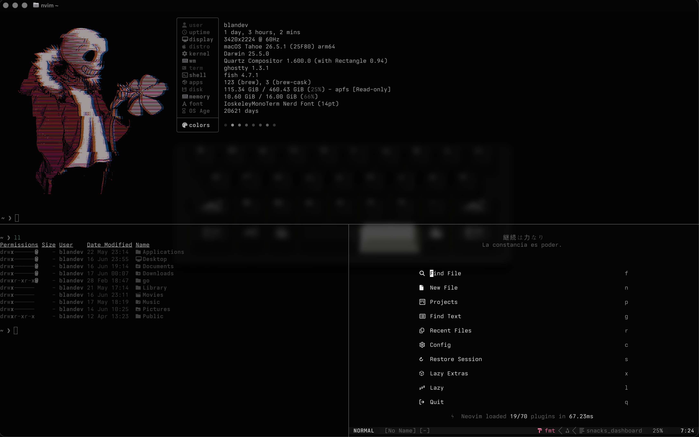

# dotfiles

Personal dotfiles for macOS and Linux, featuring Neovim, Tmux, Fish, Ghostty, and a streamlined terminal-first workflow.

> Based on [Gentleman.Dots](https://github.com/Gentleman-Programming/Gentleman.Dots) by [@Gentleman-Programming](https://github.com/Gentleman-Programming).

## Showcase 



## Features 

### 🖥️ Terminal & Shell

| Tool                                 | Role                 | Highlights                                                                           |
| ------------------------------------ | -------------------- | ------------------------------------------------------------------------------------ |
| [**Ghostty**](https://ghostty.org/)  | Terminal emulator    | Frosted glass background, dual dark/light themes, native split panes, Dank Mono font |
| [**Fish**](https://fishshell.com/)   | Shell                | Vi key bindings, curated aliases, smart tab completion out of the box                |
| [**Zellij**](https://zellij.dev/)    | Terminal multiplexer | Persistent sessions, custom pane/tab keybindings, floating panes                     |
| [**Starship**](https://starship.rs/) | Prompt               | Fast, context-aware, shows git, language runtime, and more at a glance               |

### ⚡ Navigation & Productivity

| Tool                                                | Role          | Highlights                                                                 |
| --------------------------------------------------- | ------------- | -------------------------------------------------------------------------- |
| [**fzf**](https://github.com/junegunn/fzf)          | Fuzzy finder  | Wired into the fish shell for history, file, and process searching         |
| [**zoxide**](https://github.com/ajeetdsouza/zoxide) | Smart `cd`    | Remembers your most visited directories and jumps to them instantly        |
| [**Atuin**](https://atuin.sh/)                      | Shell history | Encrypted, synced history across machines with fuzzy search and statistics |
| [**Carapace**](https://carapace.sh/)                | Completions   | Multi-shell completion for hundreds of CLI tools                           |
| [**Ranger**](https://ranger.github.io/)             | File manager  | Vim-inspired TUI file browser with image preview support                   |
| [**Posting**](https://posting.sh/)                  | HTTP client   | Terminal-based alternative to Postman — great for API development          |

### 🔧 Modern CLI Replacements

| Tool                                      | Replaces | Aliases                                                                            |
| ----------------------------------------- | -------- | ---------------------------------------------------------------------------------- |
| [**eza**](https://eza.rocks/)             | `ls`     | `ls` → icons + colors · `ll` → long view with git status · `tree` → directory tree |
| [**bat**](https://github.com/sharkdp/bat) | `cat`    | `cat` → syntax-highlighted output with line numbers                                |

### 📝 Editor

| Tool                                                                   | Role        | Highlights                                                                                   |
| ---------------------------------------------------------------------- | ----------- | -------------------------------------------------------------------------------------------- |
| [**Neovim**](https://neovim.io/) + [**LazyVim**](https://lazyvim.org/) | Code editor | Full IDE experience: LSP, completions, Copilot, CodeCompanion, fuzzy search, git integration |
| [**Lazygit**](https://github.com/jesseduffield/lazygit)                | Git TUI     | Integrated inside Neovim — stage hunks, rebase, resolve conflicts visually                   |

### 📊 System

| Tool                                             | Role            | Highlights                                              |
| ------------------------------------------------ | --------------- | ------------------------------------------------------- |
| [**btop**](https://github.com/aristocratos/btop) | Process monitor | Beautiful real-time resource monitor with responsive UI |

### 🧰 Development Runtimes

| Tool                                        | Role                                                  |
| ------------------------------------------- | ----------------------------------------------------- |
| [**pyenv**](https://github.com/pyenv/pyenv) | Python version manager                                |
| **Node.js**                                 | JavaScript runtime (LSP servers, Copilot, Angular)    |
| **pipx**                                    | Isolated Python CLI tool installer (used for Posting) |

## Key Features

- Modal shell editing with Fish Vi Mode
- Terminal-first workflow
- IDE-like Neovim setup powered by LazyVim
- AI-assisted coding with GitHub Copilot and CodeCompanion
- Fast project navigation using fzf and zoxide
- Persistent terminal sessions with Zellij
- Git workflow optimized with Lazygit
- Consistent prompt across environments with Starship

## Automated Installation 

> [!WARNING]
> The automated installation script currently supports macOS only.

```bash
git clone https://github.com/blandevv/dotfiles.git
cd dotfiles
chmod +x install.sh
./install.sh
```

## Manual Installation

If you're using Linux, feel free to copy the configuration files manually or adapt them to your distribution and package manager.
